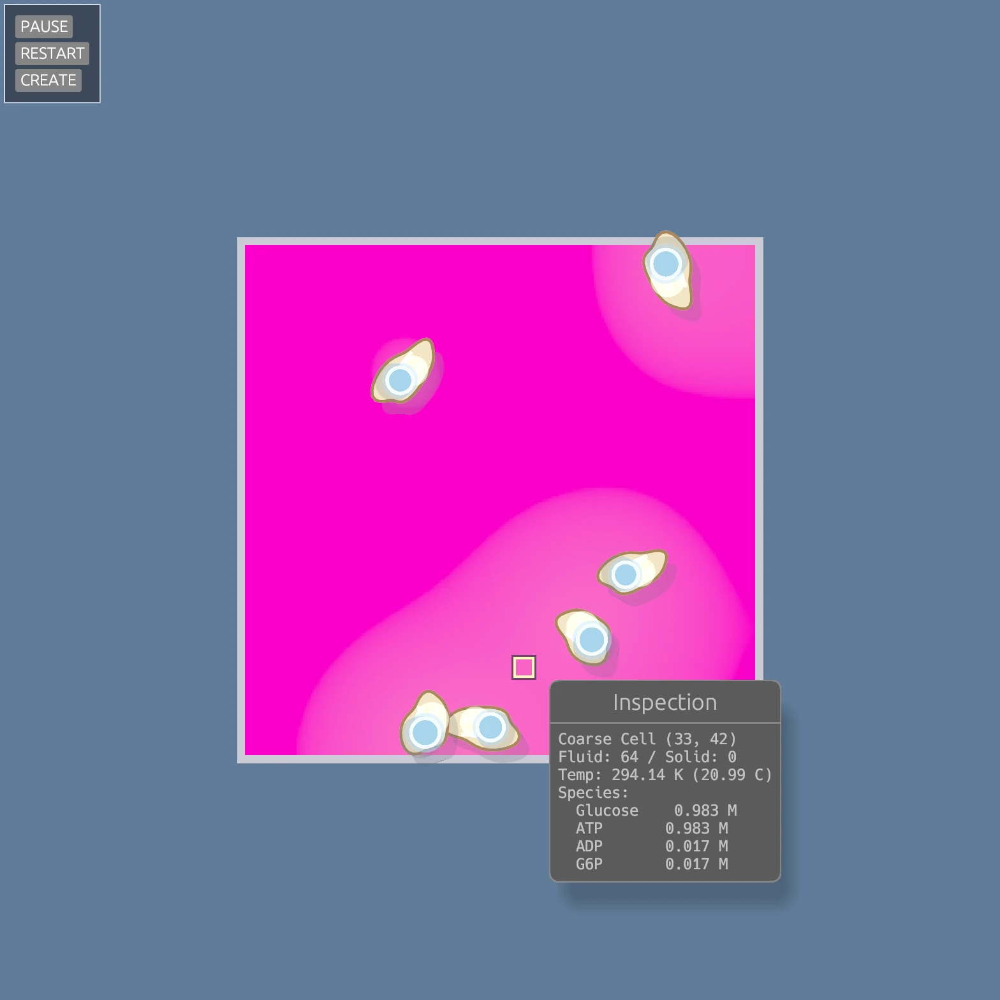
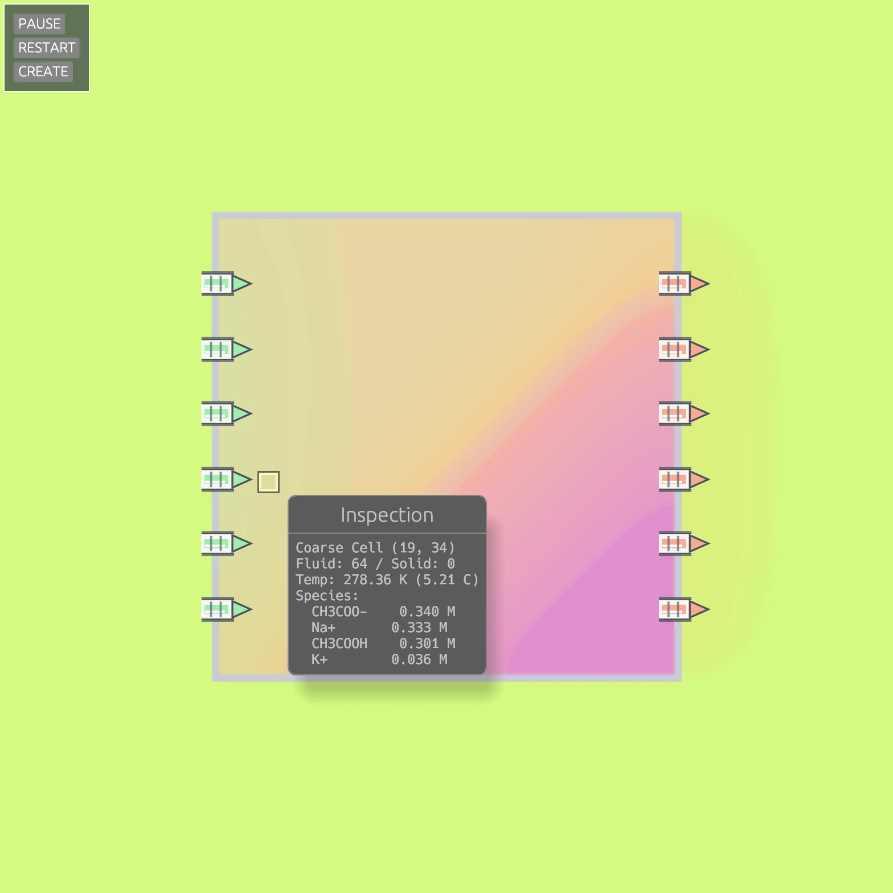

# Lyfe
[](https://github.com/thavlik/lyfe/pulse)
[](https://github.com/thavlik/lyfe#license)

Lyfe is a GPU-accelerated 2D chemical transport sandbox written in Rust on top of Vulkan. The project currently includes a Lean-backed reaction layer, coarse semantic snapshots, thermal transport, membrane leak channels, and moving enzyme entities. It represents "pre-production R&D" for a video game.

At a high level:

- `fluidsim` runs the fine-grid simulation on the GPU.
- `kinetics` builds coarse semantic snapshots and invokes Lean for low-frequency rule evaluation.
- `lean` contains the `lyfe-rules` executable that decides which reactions are active.
- `renderer` visualizes concentrations and temperature.
- `demo` ties everything together into an interactive desktop application.

## Screenshots
<p>
  
  
</p>

## Current Feature Set

### Fine-grid GPU simulation

- Multi-species transport on a dense `[species][cell]` buffer layout.
- Explicit diffusion on Vulkan compute shaders with ping-pong buffers.
- Solid geometry and material masks for impermeable walls and embedded structures.
- Per-cell temperature field with a separate thermal diffusion pass.
- Optional charge-correction / electrochemical transport heuristics for ionic systems.
- Shared render/simulation Vulkan context so rendering can bind live simulation buffers directly.

### Lean-backed kinetics and semantics

- `fluidsim` builds a coarse semantic snapshot once per simulated second.
- `kinetics` serializes that snapshot to JSON and sends it to Lean (`lyfe-rules`)
- Lean returns compact reaction directives instead of replacing the simulation state.
- The returned directives can carry:
  - Mass-action or Michaelis-Menten kinetics.
  - Tile-local applicability.
  - Thermodynamic metadata such as $\Delta H$, $\Delta G$, $\Delta S$, and activation energy.
- The GPU reaction pass consumes those directives and updates concentration and temperature fields in-place.

### Chemistry currently implemented

- Strong acid/base neutralization: $\mathrm{H^+ + OH^- \rightarrow H_2O}$.
- Weak-acid buffer behavior for acetic acid / acetate systems.
- Direct neutralization of acetic acid by hydroxide.
- Catalyst-gated phosphorylation rule for hexokinase.
- Michaelis-Menten support for catalyst-driven reactions.

### Membranes, leaks, and enzymes

- Leak channels embedded in solid boundaries for directional transport experiments.
- Electrochemical leak heuristics that preserve directional flow while damping unstable local charge separation.
- Moving enzyme entities with drift, rotation, and thermal/circulation heuristics.
- Enzyme-specific GPU pass for entity-mediated catalysis separate from dissolved catalyst rules.

### Inspection and debugging

- Async coarse inspection readback for hover tooltips.
- Detail mode with pinned probe callouts around the simulation viewport.
- Thermal visualization overlay.
- Performance overlay for frame-time monitoring.
- Smoke-test mode that renders a few frames and exits.

## Workspace Layout

- `fluidsim`: core simulation crate.
  - GPU transport, reaction, leak, enzyme, and thermal compute passes.
  - Scenario builders and coarse semantic snapshot generation.
  - Inspection, material, and species registries.
- `kinetics`: low-frequency semantic evaluation crate.
  - Snapshot/update types.
  - Lean bridge and evaluator.
  - Rule-engine configuration and diagnostics.
- `lean`: Lean 4 rule engine.
  - Owns the semantic rule definitions.
- `renderer`: Vulkan rendering and egui overlay crate.
- `demo`: interactive application and scenario runner.

## Simulation Flow

Each frame, the demo advances the fine-grid simulation on the GPU and renders the current concentration or temperature field. On a slower cadence, the simulation also performs a semantic pass:

1. Build a coarse snapshot from the current grid.
2. Send that snapshot to Lean through the `kinetics` crate.
3. Receive reaction directives for the tiles where rules are active.
4. Upload those directives back to the GPU.
5. Continue the fine-grid simulation with updated kinetics parameters.

This split keeps high-frequency transport on the GPU while moving rule selection and reaction semantics into Lean.

## Scenarios

The demo currently ships with six scenarios:

- `basic`: the original Na/K/Cl transport demo inside a hollow titanium box with a temperature split.
- `acid-base`: strong acid / strong base mixing with exothermic neutralization.
- `buffers`: weak-acid buffer against NaOH, including acetate/acetic-acid equilibrium.
- `catalyst`: dissolved hexokinase driving glucose phosphorylation.
- `enzyme`: moving enzyme entities performing the same phosphorylation chemistry as localized actors.
- `leak`: buffered ionic system with membrane leak channels for K+ and Na+ transport.

## Building

### Requirements

- Rust 2024 edition toolchain.
- Vulkan 1.2-capable GPU and working Vulkan driver.
- Lean 4 and Lake.
- Linux desktop environment with X11 or Wayland (other platforms may work but are untested).

### Build the Lean rule engine

The simulation initializes the kinetics layer by default, so the Lean executable should be built before running the demo:

```bash
cd lean
lake build
cd ..
```

By default, the Rust side looks for the binary in one of these locations:

- `LYFE_LEAN_BINARY`
- `lean/.lake/build/bin/lyfe-rules`
- `../lean/.lake/build/bin/lyfe-rules`
- `lyfe-rules` on `PATH`

If you build the Lean binary somewhere else:

```bash
export LYFE_LEAN_BINARY=/absolute/path/to/lyfe-rules
```

### Build the Rust workspace

```bash
cargo build --release
```

## Running The Demo

Show CLI help:

```bash
cargo run -p demo -- --help
```

Run the default scenario:

```bash
cargo run --release -p demo
```

Run a specific scenario:

```bash
cargo run --release -p demo -- acid-base
cargo run --release -p demo -- buffers
cargo run --release -p demo -- catalyst
cargo run --release -p demo -- enzyme
cargo run --release -p demo -- leak
```

Useful flags:

- `--detail`: render the sim as an inset with pinned inspection probes.
- `--smoke-test`: render 5 frames and exit.
- `--present-mode auto|fifo|mailbox`: choose Vulkan present mode. `auto` prefers `fifo` on X11 for capture compatibility.

Examples:

```bash
cargo run --release -p demo -- --detail leak
cargo run --release -p demo -- --smoke-test basic
cargo run --release -p demo -- --present-mode fifo enzyme
```

## Controls

General controls:

- Mouse hover: inspect the coarse cell under the cursor.
- `Space`: pause or resume the simulation.
- `+` / `-`: increase or decrease the inspection mip factor.
- Hold `T`: show the thermal view.
- `Tab`: toggle the performance overlay.
- `Shift+R`: reset the current scenario.
- `Escape`: quit.

Leak editor controls:

- Use the egui `CREATE` panel to add leak channels.
- Left click selects a leak channel or confirms placement/transform.
- `R`: rotate a leak channel by 45 degrees while placing or transforming it.
- With a leak channel selected, `T` enters transform mode.
- `Delete`: remove the selected leak channel.

## Tests And Probes

The `fluidsim` crate includes probe binaries and regression tests for the newer chemistry and transport paths:

- `acid_base_probe`: checks center-window neutralization and exothermic heating.
- `buffer_probe`: checks weak-acid / hydroxide consumption and acetate formation.
- `leak_probe`: checks K+ inward flow, Na+ outward flow, mass conservation, and bounded local charge error.

Run them with:

```bash
cargo test -p fluidsim
```

## Notes

- The Lean layer is the source of truth for active semantic rules. Adding new rule families is intended to happen in Lean first, with Rust remaining mostly rule-agnostic.
- The simulation is intentionally split into a fast fine-grid transport loop and a slower semantic reasoning loop.
- The demo is Linux-focused today and assumes working Vulkan presentation support.
- Capturing with OBS might not work properly due to use of low-level Vulkan presentation.
- Chemical species are currently represented with molecular formulae. Plans are in motion to represent species as full structural formulae.

## Contributing

Contributions are welcome. Feel free to open an issue to begin discussion on new features.

## License

All of the code in this repository is released under Apache 2.0 / MIT dual-license.